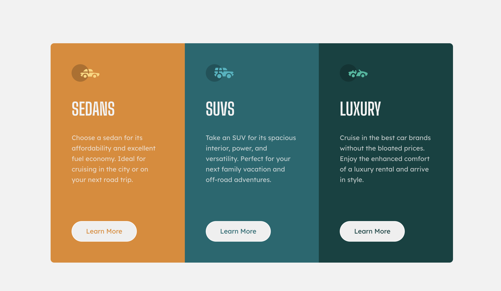

# Frontend Mentor - 3-column preview card component solution

This is a solution to the [3-column preview card component challenge on Frontend Mentor](https://www.frontendmentor.io/challenges/3column-preview-card-component-pH92eAR2-). Frontend Mentor challenges help you improve your coding skills by building realistic projects.

### The challenge

Users should be able to:

- View the optimal layout depending on their device's screen size
- See hover states for interactive elements

### Screenshot

### Links

- Live Site URL: [Add live site URL here: https://product-preview-card-component-main-bfby.vercel.app/

### Built with

- Semantic HTML5 markup
- CSS custom properties
- Flexbox
- CSS media query to modify it for mobile screens

### What I learned

1.Every HTML document should contain h1.
2.It is better to use 'a' tab instead of a 'button' when there is a redirect to another page. 'button' is used for things like submitting forms.
3.I used media query to change the appearance for mobile devices.

### Continued development

Flexbox, CSS Grid.
